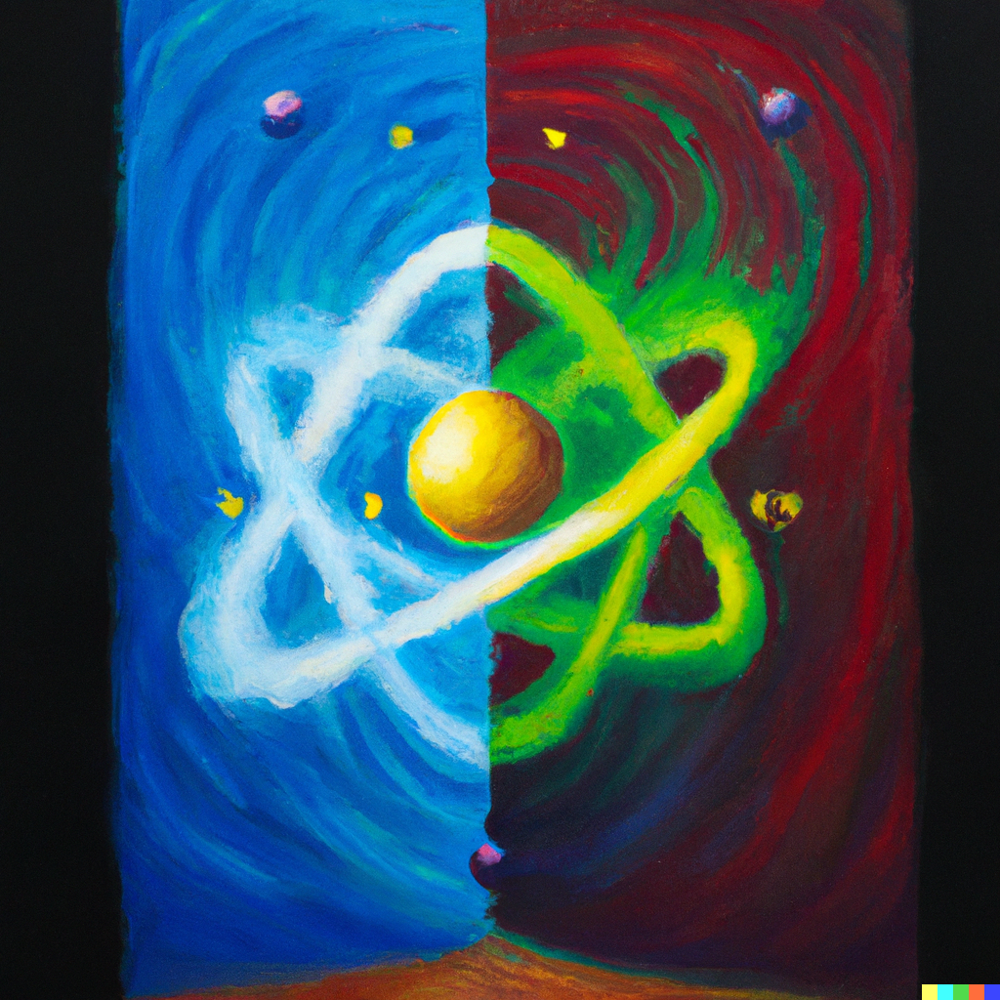

footer: Carsten Wulff 2023
slidenumbers:true
autoscale:true
theme: Plain Jane, 1
text:  Helvetica
header:  Helvetica

<!--pan_skip: -->
## TFE4188 - Lecture 4
# Analog frontend and filters
---

<!--pan_skip: -->

#[fit] Why

---

<!--pan_skip: -->

The world is analog and is written in the mathematics of calculus [^1] 

$$ \oint_{\partial \Omega} \mathbf{E} \cdot d\mathbf{S} = \frac{1}{\epsilon_0} \iiint_{V} \rho
\cdot dV$$  
Relates net electric flux to net enclosed electric charge

$$ \oint_{\partial \Omega} \mathbf{B} \cdot d\mathbf{S} = 0$$
Relates net magnetic flux to net enclosed magnetic charge

$$ \oint_{\partial \Sigma} \mathbf{E} \cdot d\mathbf{\ell} = - \frac{d}{dt}\iint_\Sigma \mathbf{B}
\cdot d\mathbf{S}$$
Relates induced electric field to changing magnetic flux

$$ \oint_{\partial \Sigma} \mathbf{B} \cdot d\mathbf{\ell} = \mu_0\left(
\iint_\Sigma \mathbf{J} \cdot d\mathbf{S} + \epsilon_0 \frac{d}{dt}\iint_\Sigma
\mathbf{E} \cdot d\mathbf{S} \right)$$
Relates induced magnetic field to changing electric flux and to current

[^1]: [Maxwell's equations](https://en.wikipedia.org/wiki/Maxwell%27s_equations)

---

<!--pan_skip: -->

The behavior of particles is written in the mathematics of quantum mechanics

$$\psi(x,t) = Ae^{j(kx - \omega t)}$$
Probability amplitude of a particle

$$ \frac{1}{2 m} \frac{\hbar}{j^2} \frac{\partial^2}{\partial^2 x}\psi(x,t) +
U(x)\psi(x,t) = -\frac{\hbar}{j}\frac{\partial}{\partial t} \psi(x,t)$$
Time evolution of the energy of a particle[^2]

$$ \frac{n_n}{n_p} = \frac{e^{(E_{p} - \mu) / kT} + 1}{e^{(E_{n} - \mu) /
kT} + 1}  $$
Relates the average number of fermions in thermal equlilibrium to the
energy of a single-particle state[^3] 

[^2]: [Schrödinger equation](https://en.wikipedia.org/wiki/Schrödinger_equation)

[^3]: [Fermi-Dirac statistics](https://en.wikipedia.org/wiki/Fermi–Dirac_statistics)

---

<!--pan_skip: -->

[.table-separator: #000000, stroke-width(1)] 
[.table: margin(8)]

The abstract digital world is written in the mathematics of boolean algebra[^4]

$$ 1 = \text{True} $$, $$ 0 = \text{False} $$

| A | B | NOT(A AND B) |
|:---|:---|:---|
| 0 | 0 | 1 |
| 0 | 1 | 1 |
| 1 | 0 | 1 |
| 1 | 1 | 0 |

All digital processing can be made with the NOT(A AND B) function!

[^4]: [Boolean algebra](https://en.wikipedia.org/wiki/Boolean_algebra)

---

<!--pan_skip: -->

# People that make digital circuits can easily reuse the work of others

---

<!--pan_skip: -->

#  People that make analog circuits can learn from others, but need to deal with the real world on their own

---

<!--pan_skip: -->

### Should we do as much as possible in the abstract digital world? 

 

---

<!--pan_title: Analog frontend and filters -->

<!--pan_doc: 

## Introduction

The world is analog, and these days, we do most signal processing in the digital domain. 
With digital signal processing we can reuse the work of others, buy finished IPs, 
and probably do processing at lower cost than for analog.

Analog signals, however, might not be suitable for conversion to digital.

A sensor might have a high, or low impedance, and have the signal in the voltage, current, charge 
or other domain.

To translate the sensor signal into something that can be converted to digital we use 
analog front-ends (AFE). How the AFE looks will depend on application, but it's common 
to have amplification, frequency selectivity or domain transfer, for example current to voltage.

An ADC will have a sample rate, and will alias any signal above half the sample rate, as such, 
we also must include a anti-alias filter in AFE that reduces any signal outside the bandwidth of the ADC as 
close to zero as we need.

-->

---

<!--pan_doc:

One example of an analog frontend is the recieve chain of a typical radio, shown below. The signal
that arrives at the antenna, or the "sensor", can be  weak, maybe -90 dBm, which is 
a power of $10^{-90/10} \times 1\text{ mW } = 1\text{ pW }$ or 50 $\mu$V RMS in 50 Ohm.

At the same time, at another frequency, there could be a signal of 0 dBm, or 0 mW, or 50 mV in 50 Ohm. 

As such, there is a 1000 times difference between the wanted signal and the unwanted signal. Assume for the moment we actually 
used an ADC at the antenna, how many bits would we need?

Bluetooth uses Gaussian Frequency Shift Keying, which is a constant envelope binary modulation, and it's ususally sufficient with low number of bits, assume 8-bits for the signal is more than enough.

But with the unwanted signal being 1000 times bigger, we would need an additional 10-bits, in total 18-bits. If we were to sample at 5 GHz, to ensure the bandwidth is sufficient for a 2.480 GHz 
maximum frequency we can actually compute the power consumption.

Given the Walden figure of merit of $FOM = \frac{P}{2^{ENOB}fs}$. The best FOM in literature is about 1 fJ/step, so $P = 1\text{ fJ/step} \times 2^{18} \times 5\text{GHz} = 1.31\text{ W}$, which is not an impossible number,
but it's certainly not what Bluetooth ICs do, because they consume around 20 mW in recieve mode.

In the radio below has multiple blocks in the AFE. First is low-noise amplifier (LNA) amplifying the signal by maybe 10 times, this reduces 
the noise impact of the following blocks. The next is the complex mixer stage, which shifts the input signal from radio frequency
down to a low frequency, but higher than the bandwidth of the wanted signal. Then there is a complex anti-alias signal, also
called a poly-phase filter, which rejects parts of the unwanted signals. Lastly there is a complex ADC to convert to digital.

In digital we can further filter to select exactly the wanted signal. Digital filters can have high stop band attenuation
at a low power and cost. There could also be digital mixers to further reduce the frequency.

What the AFE does is really to make the system more efficient. In the 5 GHz ADC output there lot's of information that we don't use.

An AFE can reduce the system power consumption by constraining digital information processing and conversion to 
only what we're interested in.

There are instances, though, where the full 2.5 GHz bandwidth has useful information. Imagine in a cellular base station
that should process multiple cell-phones at the same time. In that case, it could make sense with an ADC at the antenna. 

What make sense depends on the application.

-->

---
<!--pan_skip:-->

##[fit] You must know application before you make the AFE!

---

#[fit] Filters

<!--pan_doc: 

A filter can be fully described by the transfer function, usually denoted by $H(s) = \frac{\text{output}}{\text{input}}$.

Most people will today start with a high-level simulation, in for example Matlab, or Python, when designing their system. 
Once they know roughly how the transfer function looks, then they will start to implement the actual analog circuit.

For us, the question becomes, given an $H(s)$, how do we make the circuit?
It can be shown that a combination of 1'st and 2'nd order stages can synthesize any order filter. 
To break down $H(s)$ into first and second order stages we could use symbolic tools like Maple, and maybe it's even possible
in Python these days.

Once we have the first and second order stages, we can start looking into circuits. 

-->

---

<!--pan_skip:-->

# [fit] A combination of 1'st and 2'nd order stages can synthesize any order filter

---

# First order filter

<!--pan_doc: 

In the book they use signal flow graphs to show how the first order stage can be generated. By selecting the coefficients $k_0$
,$k_1$ and $\omega_0$ we can get any first order filter, and thus match the $H(s)$ we want.

I would encourage you to try and derive from the signal flow graph the $H(s)$ and prove to your self the equation is correct.

-->

$$ H(s) =\frac{V_o(s)}{V_i(s)}  = \frac{ k_1 s + k_0 }{s + w_o}$$

## **Q:** Try to calculate the transfer function from the figure

---
# Second order filter 

Bi-quadratic is a general purpose second order filter.

<!--pan_doc: Bi-quadratic just means "there are two quadratic equations". Once we match the $k$'s $\omega_0$ and $Q$ to our wanted $H(s)$ we can proceed with the circuit implementation.-->

 $$ H(s) = \frac{k_2 s^2 + k_1 s + k_0}{s^2 + \frac{\omega_0}{Q} s +
 \omega_o^2}$$

## **Q:** Try to calculate the transfer function from the figure

---

 
## How do we implement the filter sections?

<!--pan_doc: 

While I'm sure you can invent new types of filters, and there probably are advanced ones, I would say it's three types.
Passive filters, but they cannot have gain. Active-RC filters, which need OTAs, but are trivial to get linear. And $G_m-C$ filters,
where we use the transconductance of a transistor and a capacitor to set the coefficients. $G_m-C$ are usually more power efficient
than Active-RC, but they are also more difficult to make linear enough. 

In many AFEs, or indeed Sigma-Delta modulator loop filters, it's common to find a first Active-RC stage, and then
$G_m-C$ for later stages. 

-->

---

#[fit] Gm-C

---

<!--pan_doc:

In the figure below you can see a typical $G_m-C$ filter and the equations for the transfer function. One important thing to note
is that this is $G_m$ with capital G, not the $g_m$ that we use for small signal analysis. 

In a $G_m-C$ filter the input and output nodes will have significant swing, and thus cannot be considered small signal.

-->

$$ V_o = \frac{I_o}{s C} = \frac{\omega_{ti}}{s} V_i $$

$$ \omega_{ti} = \frac{G_m}{C}$$

## **Q:** gm = Gm ?  

---

<!--pan_doc:

In a real IC we would almost always use differential circuit, so the $G_m-C$ filter would look like below. 

-->

$$ s C V_o = G_m Vi $$

$$ H(s) = \frac{V_o}{V_i} = \frac{G_m}{sC}$$

---

## **Q:** Calculate the transfer function

---

<!--pan_doc: 

The figure below shows a implementation of a first-order $G_m-C$ filter that matches our signal flow graph. 

I would encourage you to try and calculate the transfer function.

-->

<!--pan_doc: 

Given the transfer function from the signal flow graph, we see that we can select $C_x$, $C_a$ and $G_m$ to get the desired
$k$'s and $\omega_0$

-->

$$ H(s) = \frac{ k_1 s + k_0 }{s + w_o}$$
 
$$ H(s) = \frac{s \frac{C_x}{C_a + C_x} + \frac{G_{m1}}{C_a + C_x}}{s +
 \frac{G_{m2}}{C_a + C_x}}$$

## **Q:** Try and calculate the transfer function

---

$$ H(s) = \frac{k_2 s^2 + k_1 s + k_0}{s^2 + \frac{\omega_0}{Q} s +
 \omega_o^2}$$

$$ H(s) = \frac{ s^2\frac{C_X}{C_X + C_B} + s\frac{G_{m5}}{C_X + C_B} + \frac{G_{m2}G_{m4}}{C_A(C_X + C_B)}}
{s^2 + s\frac{G_{m2}}{C_X + C_B} + \frac{G_{m1}G_{m2}}{C_A(C_X + C_B)} }$$

---

<!--pan_skip:-->

## **Q:** Try and figure out how we could make a transconductor

---

#[fit] Active-RC

<!--pan_doc: 

The Active-RC filter should be well know at this point. However, what might be new is that the open looop gain $A_0$ and unity gain
$\omega_{wt}$ 

-->

---

## General purpose first order 

$$ H(s) = \frac{ k_1 s + k_0 }{s + w_o}$$

$$ H(s) = \frac{  -\frac{C_1}{C_2}s -\frac{G_1}{ C_2}}{s + \frac{G_2}{ C_2}}$$

## **Q:** Try and calculate the transfer function

---
## General purpose biquad 

$$ H(s) = \frac{k_2 s^2 + k_1 s + k_0}{s^2 + \frac{\omega_0}{Q} s +
 \omega_o^2}$$

$$H(s) = \frac{\left[ \frac{C_1}{C_B}s^2 + \frac{G_2}{C_B}s + (\frac{G_1G_3}{C_A C_B})\right]}{\left[ s^2  + \frac{G_5}{C_B}s + \frac{G_3 G_4}{C_A C_B}\right]}$$

---

# The OTA is not ideal

 
 $$ H(s) \approx \frac{A_0}{(1 + s A_o R C)(1 + \frac{s}{w_{ta}})}$$
 
 where $$A_0$$ is the gain of the amplifier, and $$\omega_{ta}$$ is the unity-gain frequency.
 
## **Q:** In what region does this equation match an ideal integrator 1/sRC response?
 
---

[A 56 mW Continuous-Time Quadrature Cascaded Sigma-Delta Modulator With 77 dB DR in a Near Zero-IF
20 MHz Band](https://ieeexplore.ieee.org/stamp/stamp.jsp?tp=&arnumber=4381437)

---

#[fit] Thanks!

---
