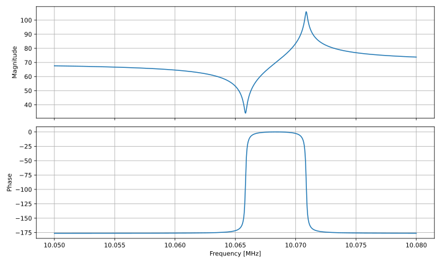
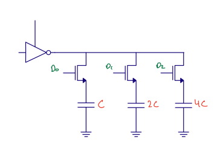
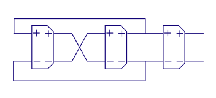
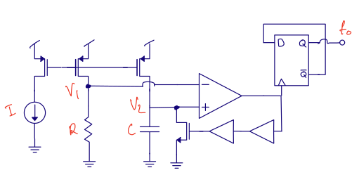

footer: Carsten Wulff 2023
slidenumbers:true
autoscale:true
theme:Plain Jane,1

<!--pan_skip: -->

## TFE4188 - Introduction to Lecture 9
# Oscillators

<!--pan_title: Lecture 9 - Oscillators -->

---

# Goal

<!--pan_skip: -->

Introduction to **Crystal Oscillators**

Introduction to **VCOs**

Introduction to **Relaxation-oscillators**

---

<!--pan_doc: 

<iframe width="560" height="315" src="https://www.youtube.com/embed/V8VYUI_scNM" title="YouTube video player" frameborder="0" allow="accelerometer; autoplay; clipboard-write; encrypted-media; gyroscope; picture-in-picture; web-share" allowfullscreen></iframe>

-->

# Crystal oscillators

---

---

---

Assuming zero series resistance

$$ Z_{in} = \frac{s^2 C_F L + 1}{s^3 C_P L C_F + s C_P + s C_F}$$

Since the 1/(sCp) does not change much at resonance, then 

$$ Z_{in} \approx \frac{L C_F s^2 + 1}{L C_F C_p s^2 + C_F + C_P}$$

See [Crystal oscillator impedance](https://github.com/wulffern/aic2023/blob/main/jupyter/xosc.ipynb) for a detailed explanation.

---

---

Negative transconductance compensate crystal series resistance

Long startup time caused by high Q

Can fine tune frequency with parasitic capacitance

---

---

# Controlled Oscillators

---

## Ring oscillator

$$ t_{pd} \approx R C $$

$$ R \approx \frac{1}{gm} \approx \frac{1}{\mu_n C_{ox} \frac{W}{L} (VDD - V_{th})}$$

$$ C \approx \frac{2}{3} C_{ox} W L$$

---

$$ t_{pd} \approx \frac{2/3 C_{ox} W L}{\frac{W}{L} \mu_n C_{ox}(VDD - V_{th})}$$

$$ f = \frac{1}{2 N t_{pd}} = \frac{\mu_n (VDD-V_{th})}{\frac{4}{3} N L^2}$$ 

$$ K_{vco} = 2 \pi \frac{\partial f}{\partial VDD} = \frac{2 \pi \mu_n}{\frac{4}{3} N L^2}$$

---
## Capacitive load 

$$ f = \frac{\mu_n C_{ox} \frac{W}{L} (VDD - V_{th})}{2N\left(\frac{2}{3}C_{ox}WL + C\right)}$$

$$ K_{vco} = \frac{2 \pi \mu_n C_{ox} \frac{W}{L}}{2N\left(\frac{2}{3}C_{ox}WL + C\right)}$$

---
## Realistic 

$$ I = C \frac{dV}{dt}$$

$$ f \approx \frac{ I_{control}  + \frac{1}{2}\mu_p C_{ox} \frac{W}{L} (VDD - V_{control} -
V_{th})^2}{C \frac{VDD}{2} N}$$

$$ K_{vco} = 2 \pi \frac{\partial f}{\partial V_{control}}$$

$$ K_{vco} = 2 \pi  \frac{\mu_p C_{ox} W/L }{C\frac{VDD}{2}N}$$

---

## Digitally controlled oscillator 

---

# Differential

Potentially less sensitive to supply noise 

---

# LC oscillator

$$ f \propto \frac{1}{\sqrt{LC}}$$

---

# Relaxation oscillators

---

<!--pan_skip: -->

##[fit]Q: Show that Fo is 1/(2RC)

---

# Additional material

[The Crystal Oscillator - A Circuit for All Seasons](https://ieeexplore.ieee.org/document/7954123)   

[The Delay-Locked Loop - A Circuit for All Seasons ](https://ieeexplore.ieee.org/document/8447468) 

[The Ring Oscillator - A Circuit for All Seasons
](https://ieeexplore.ieee.org/document/8901474)       

---

#[fit] Thanks!
