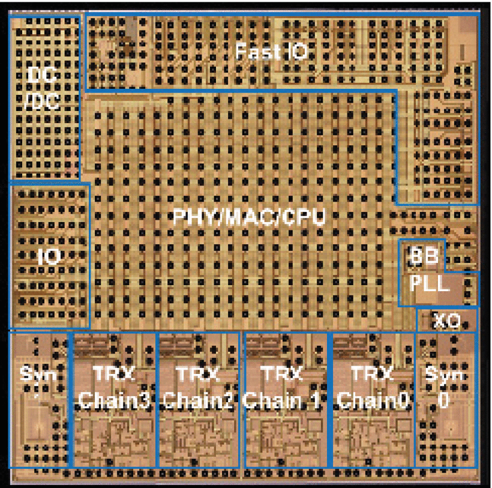
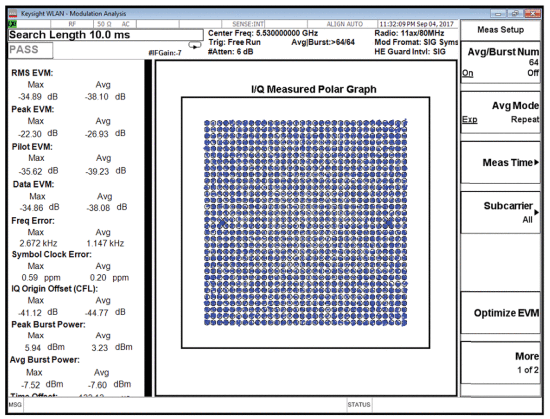
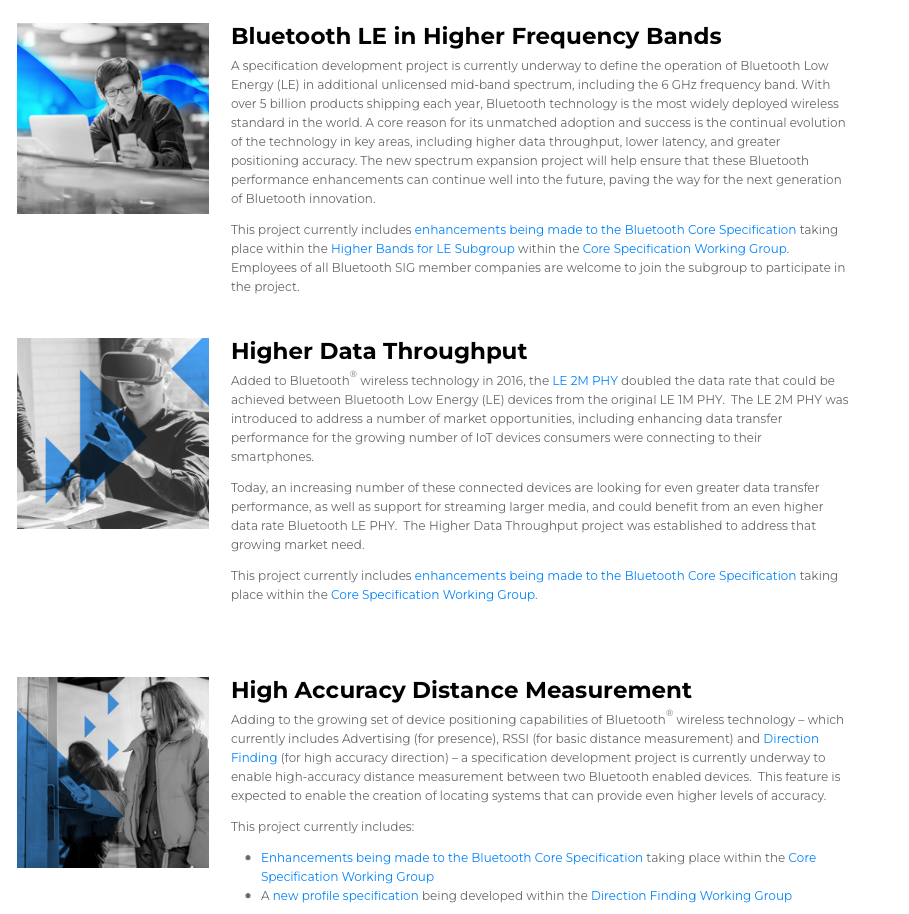
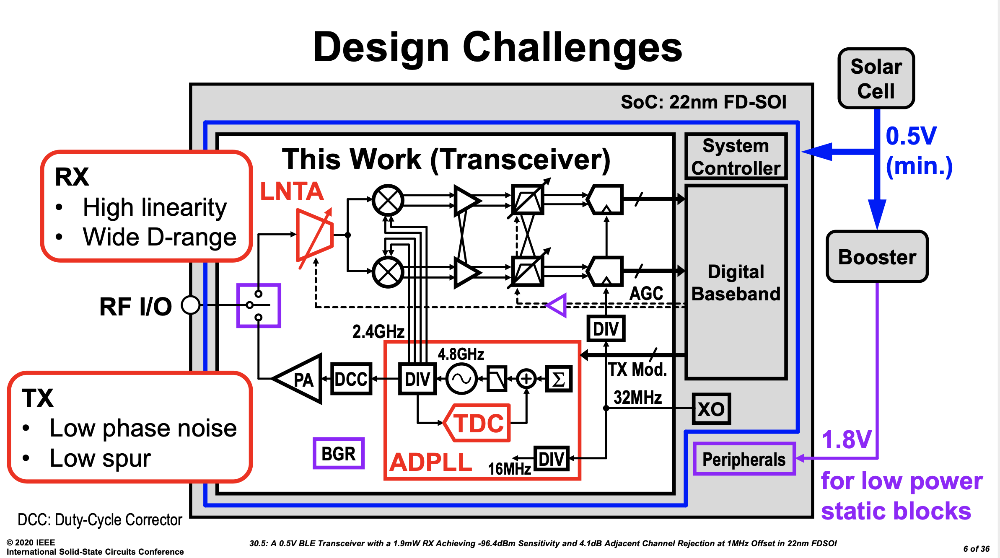
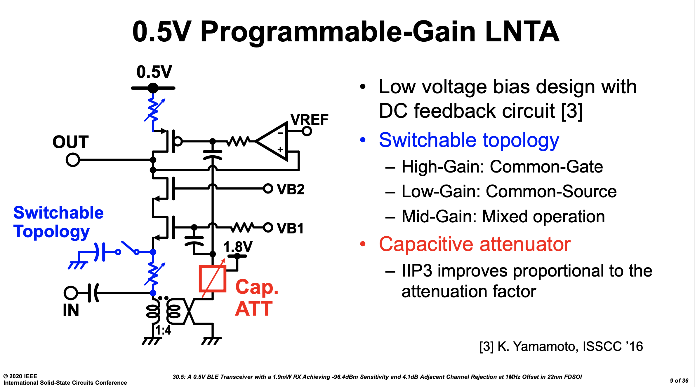
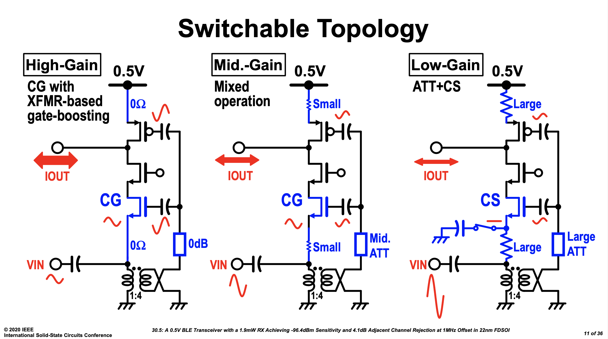
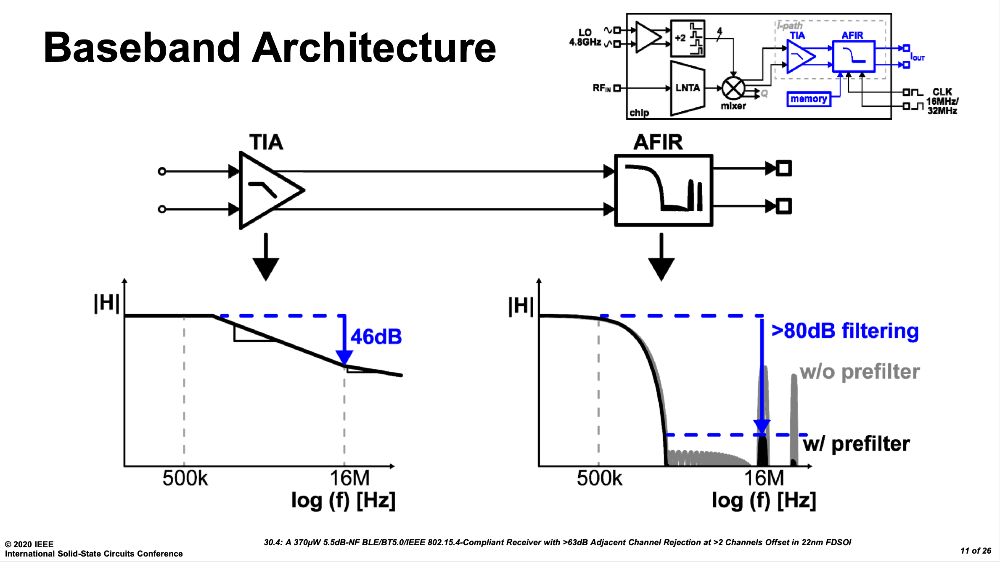
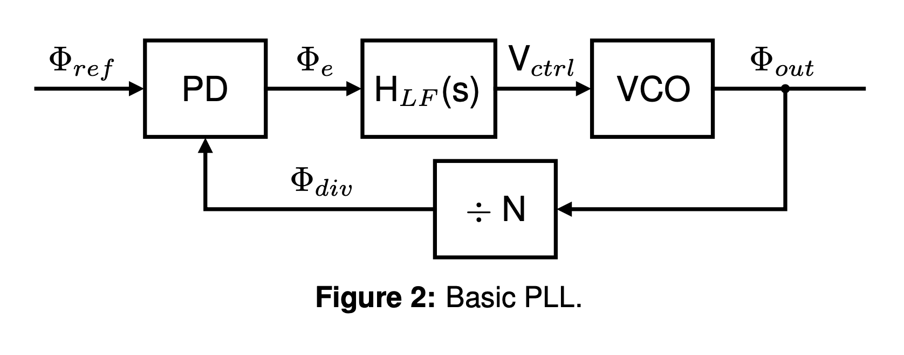

footer: Carsten Wulff 2023
slidenumbers:true
autoscale:true
theme:Plain Jane,1

[.background-color: #00A9CE]

<!--pan_skip: -->

## TFE4188 - Lecture 10
# Low Power Radio

<!--pan_title: Lecture 10 - Low Power Radio -->

---

<!--pan_skip: -->

# Goal

Let's make a radio (or at least, let's **pretend**)

---

[.background-color: #00A9CE]

<!--pan_skip: -->

## Problem statement:

#[fit] Make the best radio ICs for gaming mice

---

<!--pan_skip: -->

## What do we need to know?
- Data Rate
- Carrier Frequency & Range
- Power supply

---

<!--pan_doc:

Radio's are all around us. In our phone, on our wrist, in our house, there is Bluetooth, Wi-Fi, Zigbee, LTE, GPS and many more. 

A radio is a device that recieves and transmits light encoded with information. The frequency of the light depends on the standard. How the information is encoded onto 
the light depends on the standard.

Assume that we did not know any standards, what would we do if we wanted to make the best radio IC for gaming mice?

There are a few key concepts we would have to know before we decide on a radio type: Data Rate, Carrier Frequency and range, and the power supply.

-->

#[fit] Data Rate

---

[.column]

## Data 

<!--pan_doc:

A mouse reports on the relative displacement of the mouse as a function of time, some X and Y displacement. A mouse has buttons. There can be many mice in a room, so 
PCs would like to tell them apart, they must have an address. 

A mouse must be low-power. As such, the radio cannot be on all the time. The radio must start up and be ready to recieve quickly. We don't know how far 
away from the PC the mice might be, as such, we don't know the dB loss in the communcation channel. As a result, the radio needs to have a high dynamic range, from weak signals
to strong signals. In order for the radio to adjust the gain of the reciever we should inclue a pre-amble, a known sequence, for example 01010101, such that the radio can 
adjust the gain, and also, recover the symbol timing. 

All in all, the packets we send from the mouse may need to have the following bits.

-->

| What | Bits | Why |
| ----  | ---- | ---- |
| X displacement | 8 | |
| Y displacement | 8 | |
| CRC | 4 | Bit errors|
| Buttons| 16 | On-hot coding. Most mice have buttons|
| Preamble| 8 | Syncronization|
| Address | 32 | Unique identifier |
| Total | 76 | |

[.column]

## Rate

<!--pan_doc:

Gamers are crazy for speed, they care about milliseconds. So our mice needs to be able to send and receive data quite often. 
-->

Assume 1 ms update rate

---
## Data Rate

<!--pan_doc:

To compute the data rate, let's do a back of the envelope estimate of the data, and the rate. 

-->

Application Data Rate > 76 bits/ms = 76 kbps

Assume 30 % packet loss

Raw Data Rate > 228 kbps

Multiply by $$\pi$$ > 716 kbps

Round to nearest nice number = 1Mbps

<!--pan_doc:

The above statements are a exact copy of what happens in industry when we start design of something. We make an educated guess. More optimistic people would multiply with $e$. 

-->

---

# [fit] Carrier Frequency & Range

---
## ISM (industrial, scientific and medical) bands

<!--pan_doc:

There are rules and regulations that prevent us from transimitting and recieving at any frequency we want. We need to pick one of the ISM bands, or 
we need to get a license from goverments around the world.

But how should we pick? There are at least two critera that should be investigated. Antenna and Range. 

-->

---

## Antenna

<!--pan_doc:

For a mouse we want to hold in our hand, there is a size limit to the antenna. There are many types of antenna, but a
-->
[.column]
assume $$\lambda/4$$ is an OK antenna size ($$\lambda = c/f$$)

<!--pan_doc:

The below table shows the ISM band and the size of a quarter wavelength antenna. Any frequency above 2.4 GHz may be OK from a size perspective. 

-->

[.column]
| ISM band |$$\lambda/4$$ | Unit|OK/NOK|
|---|---:|---:|---:|
| 40.68 MHz | 1.8  | m |:x:|
| 433.92 MHz | 17 | cm|:x:|
| 915 MHz | 8.2 | cm||
| 2450 MHz | 3.06 | cm|:white_check_mark:|
| 5800 MHz | 1.29 | cm|:white_check_mark:|
| 24.125 GHz | 3.1 | mm|:white_check_mark:|
| 61.25 GHz | 1.2 | mm|:white_check_mark:|

---

## Range (Friis)

<!--pan_doc:

One of the worst questions a radio designer can get is "What is the range of your radio?", especially if the people asking are those that don't understand
physics, or the real world. The answer to the question is incredibly complicated, as it depends on exactly what is between two devices talking. 

If we assume, however, that there is only free space, and no real reflections from anywhere, then we can make an estimate of the range. 

-->

[.column]

Assume no antenna gain, power density p at distance D is

$$ p = \frac{P_{TX}}{4 \pi D^2}$$

Assume reciever antenna has no gain, then the effective apature is

$$ A_e = \frac{\lambda^2}{4 \pi}$$

[.column]

Power recieved is then

$$P_{RX} = \frac{P_{TX}}{D^2} \left[\frac{\lambda}{4 \pi}\right]^2$$

Or in terms of distance

$$ D = 10^\frac{P_{TX} - P_{RX} + 20 log_{10}\left(\frac{c}{4 \pi f}\right)}{20} $$

---

## Range (Free space)

<!--pan_doc:

If we take the ideal equation above, and use some realistic numbers for TX and RX power, we can estimate a range. 
-->

Assume TX = 0 dBm, assume RX sensitivity is -80 dBm

| Freq | **$$20 log_{10}\left(c/4 \pi f\right)$$** [dB]| D [m]| OK/NOK|
| ----|:----:| ---: | ---:|
| 915 MHz | -31.7 | 260.9 | :white_check_mark:|
| **2.45 GHz** | **-40.2** | **97.4** |:white_check_mark:|
| 5.80 GHz | -47.7 | 41.2 |:white_check_mark:|
| 24.12 GHz | -60.1 | 9.9 | :x:|
| 61.25 GHz | -68.2 | 3.9 | :x:|
| 160 GHz | -76.52| 1.5 | :x:|

---

## Range (Real world)

<!--pan_doc:

In the real world, however, the 
-->

path loss factor, $$ n \in [1.6,6]$$, $$ D = 10^\frac{P_{TX} - P_{RX} + 20 log_{10}\left(\frac{c}{4 \pi f}\right)}{n
\times 10} $$

<!--pan_doc:

So the real world range of a radio can vary more than an order of magnitude. Still, 2.4 GHz seems like a good choice for a mouse. 
-->

| Freq | **$$20 log_{10}\left(c/4 \pi f\right)$$** [dB]| D@n=2 [m]|D@n=6 [m] | OK/NOK|
| ----|:----:| ---: | ---:| ---:|
| **2.45 GHz** | **-40.2** | **97.4** | **4.6** |:white_check_mark:|
| 5.80 GHz | -47.7 | 41.2 | 3.45 |:white_check_mark:|
| 24.12 GHz | -60.1 | 9.9 | 2.1 | :x:|

---

# [fit] Power supply

<!--pan_doc:

We could have a wired mouse for power, but that's boring. Why would we want a wired mouse to have wireless communication? It must be powered by a batttery, but 
what type of battery?

There exists a bible of batteries, see picture below. It's worth a read if you want to dive deeper into chemistry and properties of primary (non-chargable) and secondary (chargable) cells.

-->

---

## Battery

Mouse is maybe AA,  3000 mAh

|Cell |Chemistry|  Voltage (V) | Capacity (Ah) |
|----|:----|----:| ---:|
| AA |LiFeS2  | 1.0 - 1.8 | 3 |
 | 2xAA |LiFeS2  | 2.0 - 3.6 | 3 |
| AA |Zn/Alk/MnO2 | 0.8 - 1.6 | 3 |
| 2xAA |Zn/Alk/MnO2 | 1.6 - 3.2 | 3 |

---
[.background-color: #00A9CE]

# Decisions we must make

<!--pan_doc:

Now we know that we need a 1 Mbps radio at 2.4 GHz that runs of a 1.0 V - 1.8 V or 2.0 V - 3.6 V supply. 

Next we need to decide what modulation scheme we want for our light. How should we encode the bits onto the 2.4 GHz carrier wave?

-->

---

## Modulation scheme

<!--pan_doc:

People have been creative over the last 50 years in terms of encoding bits onto carriers. Below is a small excerpt of some common schemes. 

-->

| Scheme | Acronym|Pro | Con |
| ----| ----|----| ----|
| Binary phase shift keying | BPSK | Simple | Not constant envelope|
| Quadrature phase-shift keying | QPSK |2bits/symbol| Not constant envelope|
| Offset QPSK |OQPSK| 2bits/symbol | Constant envelope with half-sine pulse shaping|
| Gaussian Frequency Shift Keying | GFSK | 1 bit/symbol| Constant envelope|
| Quadrature amplitude modulation| QAM | > 1024 bits/symbol| Really non-constant envelope|

---

<!--pan_doc:

## BPSK

In binary phase shift keying the 1 and 0 is encoded in the phase change. Change the phase 180 degrees and we've transitioned from a 0 to a 1. Do another 180 degrees and
we're back to where we were. 

It's common to show modulation schemes in a constellation diagram with the real axis and the complex axis. 
For the real light we send the phase and amplitude is usually real. 

I say usually, because in quantum mechanics, and the time evolution of a particle, the amplitude of the wave function is actually a complex variable. As such, nature 
is actually complex at the most fundamental level. 

But for now, let's keep it real in the real world.

Still, the maths is much more elegant in the complex plane. 

The equation for the unit circle is $ y = e^{i( \omega t + \phi)}$ where $\phi$ is the phase, and $\omega$ is the angular frequency. 

Imagine we spin a bike wheel around at a constant frequency (constant $\omega$), on the bike wheel there is a red dot. If you keep your eyes open all 
the time, then the red dot would go round and round. But imagine that you only opened your eyes every second for a brief moement to see where the dot was. 
Sometimes it could be on the right side, sometimes on the left side. If our "eye opening rate", or your sample rate, matched how fast the "wheel rotator" changed 
the location of the dot, then you could recieve information. 

Now imagine you have a strobe light matched to the "normal" carrier frequency. If one rotation of the weel matched the frequency of the strobe light, then the red dot would
stay in exactly the same place. If the wheel rotation was slightly faster, then the red dot would move one way around the circle at every strobe. If the wheel rotation was
slightly slower, the red dot would move the other way around the circle. 

That's exactly how we can change the position in the constellation. We increase the carrier frequency for a bit to rotate 180 degrees, and we can decrease the frequency to 
go back 180 degrees. In this example the dot would move around the unit circle, and the amplitude of the carrier can stay constant. 

-->

<!--pan_doc:

There is another way to change phase 180 degrees, and that's simply to swap the phase in the transmitter circuit. Imagine as below we have a local oscillator driving 
pseudo differential common source stages with switches on top. If we flip the switches we can change the phase 180 degrees pretty fast. 

A challenge is, however, that the amplitude will change. In general, constant envelope (don't change amplitude) modulation is less bandwidth efficient (slower) than schemes
that change both phase and amplitude. 

-->

---

<!--pan_doc:

Standards like Zigbee used offset quadrature phase shift keying, with a constellation as sown below. With 4 points we can send 2 bits per symbol. 

-->

<!--pan_doc:

In ZigBee, or 802.15.4 as the standard is called, the phase changes
is actually done with a constant envelope. 

The nice thing about constant envelope is that the radio transmitter can be simple. We don't need to change the amplitude. 
If we have a PLL as a local oscillator, where we can change the phase (or frequency), then we only need a power amplifier before the antenna.
-->

<!--pan_doc:

For phase and amplitude modulation, or complex transmitters, we need a way to change the amplitude and phase. What a shocker. There are two ways to do that. A polar architecture 
where phase change is done in the PLL, and amplitude in the power amplifier. 

-->

<!--pan_doc:

Or a Cartesian architecture where we make the in-phase component, and quadrature-phase 
components in digital, then use two digital to analog converters, and a set of complex mixers to encode onto the carrier. The power amplifier would not need to change
the amplitude. 
-->

---

---

---

## Single carrier, or multi carrier?

Bluetooth, 802.15.4, ANT all use one carrier
- Simple TX, constant envelope

WiFi, LTE ++ all use Ortogonal frequency division multiplexing (OFDM)
- Complex TX, non-constant envelope

---

#[fit] Let's make the best, highest data rate radio!

#[fit]\#racetoidle

---

## Use a Software Defined Radio 

 ADC FOM $$ = \frac{P}{2 BW 2^n}$$

 State of the art FOM $$\approx 5 \text{ fJ/step}$$
 
 $$ BW = 2.5\text{ GHz}$$
 $$ DR = 100\text{ dB} = (96-1.76)/6.02 \approx 16\text{ bit} $$ 

 $$ P = 5\text{ fF} \times 5 \text{ GHz} \times 2^{16} = 1.6\text{ W}$$

---

## WiFi 6 
[An 802.11ax 4 × 4 High-Efficiency WLAN AP Transceiver SoC Supporting 1024-QAM With Frequency-Dependent IQ Calibration and Integrated Interference Analyzer](https://ieeexplore.ieee.org/document/8528383)

---
 

---

---

---

<!--pan_skip: -->

## [fit] Crap, complex!
## [fit] Crap, too high power!

---
[.background-color: #00A9CE]

---

#  [Bluetooth](https://www.bluetooth.com/specifications/specs/core-specification-5-4/)

- Compromise between speed, power and cost 
- "Simple" to use
- "Simple" to implement

---

## Bluetooth Basic Rate/Extended Data rate 

- 2.400 GHz to 2.4835 GHz
- 1 MHz channel spacing
- 78 Channels
- Up to 20 dBm
- Minimum -70 dBm sensitivity (1 Mbps)
- 1 MHz GFSK (1 Mbps), pi/4-DQPSK (2 Mbps), 8DPSK (3 Mbps)

---

## Bluetooth Low Energy

- 2.400 GHz to 2.480 GHz
- 2 MHz channel spacing
- 40 Channels (3 primary advertizing channels)
- Up to 20 dBm 
- Minimum -70 dBm sensitivity (1 Mbps)
- 1 MHz GFSK (1 Mbps, 500 kbps, 125 kbps), 2 MHz GFSK (2 Mbps)

---

---

---

---

For further information [Building a Bluetooth application on nRF Connect SDK](https://devzone.nordicsemi.com/guides/nrf-connect-sdk-guides/b/software/posts/building-a-ble-application-on-ncs-comparing-and-contrasting-to-softdevice-based-ble-applications)

---
[.background-color: #00A9CE]

<!--pan_skip: -->

#[fit] Low Power Recievers

---

# Algorithm to design state-of-the-art BLE radio
- Find most recent digest from International Solid State Circuit Conference (ISSCC)
- Find Bluetooth low energy papers 
- Pick the best blocks from each paper

---

---

|Blocks| Key parameter | Architecture| Complexity (nr people)|
|---|---|---| ---|
| Antenna | Gain, impedance| ?? | <1 |
| RF match| loss, input impedance| PI-match? | <1 |
| Low noise amp | NF, current, linearity| LNTA| 1 |
| Mixer | NF, current, linearity| Passive | 1	|
| Anti-alias filter| NF, linearity| TIA + AFIR| 1|
| ADC | Sample rate, dynamic range, linearity| NS-SAR| 1 - 2| 
| PLL | Freq accuracy, phase noise, current| AD-PLL | 2-3 |
| Baseband | Eb/N0, gate count, current. | SystemVerilog | > 10|

---

# [fit] LNTA

---

---

---

---

# [fit] MIXER

---

---

---

# [fit] AAF

---

---

---

---

# [fit] ADC

---

---

---

---

---

# [fit] AD-PLL

---
#Phase Locked loops

[.column]

[.column]
- Read Razavi's PLL book [^7]

---
AD-PLL with Bang-Bang phase detector for steady-state [^5]

---

#[fit] Baseband

---

|Baseband block | Why |
|---|---|
| Mixer? | If we're using low intermediate frequency to avoid DC offset problems and flicker noise|
| Channel filters?| If the AAF is insufficient for adjaecent channel|
| Power detection | To be able to control the gain of the radio|
| Phase extraction| Assuming we're using FSK|
| Timing recovery | Figure out when to slice the symbol|
| Bit detection | single slice, multi-bit slice, correlators etc, see|
| Address detection | Is the packet for us?|
| Header detection | What does the packet contain|
| CRC  | Does the packet have bit errors|
| Payload decrypt| Most links are encrypted by AES|
| Memory access| Payload need to be stored until CPU can do something|

---

# What do we really want, in the end?

$$P_{RX_{sens}} = -174 dBm + 10 \times log10(DR)  + NF + Eb/N0$$

for example, for nRF5340 

$$ P_{RX_{sens}} + 174 - 60 =  NF + Eb/N0 = 17 dB$$

---

---

---

#[fit] Thanks!

[^1]: "A 0.5V BLE Transceiver with a 1.9mW RX Achieving -96.4dBm Sensitivity and 4.1dB Adjacent Channel Rejection at 1MHz Offset in 22nm FDSOI", M. Tamura, Sony Semiconductor Solutions, Atsugi, Japan, 30.5, ISSCC 2020

[^2]: "A 370μW 5.5dB-NF BLE/BT5.0/IEEE 802.15.4-Compliant Receiver with >63dB Adjacent Channel Rejection at >2 Channels Offset in 22nm FDSOI", B. J. Thijssen, University of Twente, Enschede, The Netherlands

[^3]: "A 68 dB SNDR Compiled Noise-Shaping SAR ADC With On-Chip CDAC Calibration", H. Garvik, C. Wulff, T. Ytterdal

[^4]: "A Compiled 9-bit 20-MS/s 3.5-fJ/conv.step SAR ADC in 28-nm FDSOI for Bluetooth Low Energy Recievers", C. Wulff, T. Ytterdal

[^5]: Cole Nielsen, https://github.com/nielscol/thesis_presentations

[^6]: "Python Framework for Design and Simulation of Integer-N ADPLLs", Cole Nielsen, https://github.com/nielscol/tfe4580-report/blob/master/report.pdf

[^7]: Design of CMOS Phase-Locked Loops, Behzad Razavi, University of California, Los Angeles

