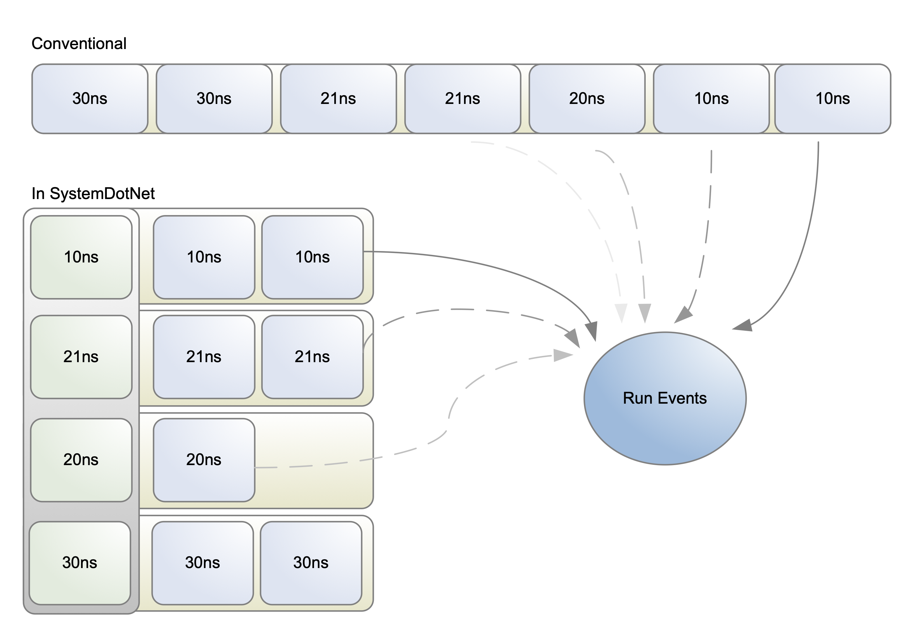

footer: Carsten Wulff 2023
slidenumbers:true
autoscale:true
theme:Plain Jane,1

<!--pan_skip: -->

# TFE4188 - Lecture 11
# Analog SystemVerilog

<!--pan_title: Lecture 11 - Analog SystemVerilog -->

---

<!--pan_skip: -->

# Goal

Explain why we need **Analog SystemVerilog** models

Introduction to Analog SystemVerilog 

---

<!--pan_doc: 

<iframe width="560" height="315" src="https://www.youtube.com/embed/56oK9FAE858" title="YouTube video player" frameborder="0" allow="accelerometer; autoplay; clipboard-write; encrypted-media; gyroscope; picture-in-picture; web-share" allowfullscreen></iframe>

-->


#[fit] Why 

---


---

## Digital simulation

- The order of execution of events at the same timestep do not matter

- The system is causal. Changes in the future do not affect signals in the past 


---

## Digital Simulators

**Commercial**
[Cadence Excelium](https://www.cadence.com/ko_KR/home/tools/system-design-and-verification/simulation-and-testbench-verification/xcelium-simulator.html)
[Siemens Questa](https://eda.sw.siemens.com/en-US/ic/questa/simulation/advanced-simulator/)
[Synopsys VCS](https://www.synopsys.com/verification/simulation/vcs.html)

**Open Source**
[iverilog/vpp](https://github.com/steveicarus/iverilog)
[Verilator](https://www.veripool.org/verilator/)
[SystemDotNet](https://sourceforge.net/projects/systemdotnet/)



---

[.column]

```verilog
module counter(
               output logic [WIDTH-1:0] out,
               input logic              clk,
               input logic              reset
               );

   parameter WIDTH = 8;

   logic [WIDTH-1:0]                    count;
   always_comb begin
      count = out + 1;
   end

   always_ff @(posedge clk or posedge reset) begin
      if (reset)
        out <= 0;
      else
        out <= count;
   end

endmodule // counter
```

[.column]

## Counter

Assume `clk, reset, out = 0`

Assume event with `clk = 1`

0: Set `out = count` in next event (1)

1: Set `count = out + 1` using logic (may consume multiple events) 

X: no further events


---


---

# Transient analog simulation 


Parse spice netlist, and setup partial/ordinary differential equations for node matrix

Model non-linear current/voltage behavior between all nodes

Use numerical methods to compute time evolution 

- [Euler](https://aquaulb.github.io/book_solving_pde_mooc/solving_pde_mooc/notebooks/02_TimeIntegration/02_01_EulerMethod.html)
- [Runge-Kutta](https://aquaulb.github.io/book_solving_pde_mooc/solving_pde_mooc/notebooks/02_TimeIntegration/02_02_RungeKutta.html)
- [Crank-Nicolson](https://en.wikipedia.org/wiki/Crank%E2%80%93Nicolson_method)
- [Gear](https://ieeexplore.ieee.org/document/1083221)

[How spice works](https://www.emcs.org/acstrial/newsletters/summer09/HowSpiceWorks.pdf)


---

[.column]

## Simulation Program with Integrated Circuit Emphasis (SPICE)

Published in 1973 by Nagel and Pederson

*SPICE (Simulation Program with Integrated Circuit Emphasis)*

[https://www2.eecs.berkeley.edu/Pubs/TechRpts/1973/ERL-m-382.pdf](https://www2.eecs.berkeley.edu/Pubs/TechRpts/1973/ERL-m-382.pdf)


[.column]


**Commercial**
[Cadence Spectre](https://www.cadence.com/ko_KR/home/tools/custom-ic-analog-rf-design/circuit-simulation/spectre-simulation-platform.html)
[Siemens Eldo](https://eda.sw.siemens.com/en-US/ic/eldo/)
[Synopsys HSPICE](https://www.synopsys.com/implementation-and-signoff/ams-simulation/primesim-hspice.html)


**Free**
[Aimspice](http://aimspice.com)
[Analog Devices LTspice](https://www.analog.com/en/design-center/design-tools-and-calculators/ltspice-simulator.html)

**Open Source**
[ngspice](http://ngspice.sourceforge.net)

---


---

#[fit] Analog SystemVerilog

---

[.column]

# TFE4152 2021 - Project


Be inspired by the ISSCC paper, and design a similar system. 

Design analog circuits in SPICE 

Design digital circuits in SystemVerilog


[A 10 000 Frames/s CMOS Digital Pixel Sensor](https://ieeexplore.ieee.org/stamp/stamp.jsp?tp=&arnumber=972156)

[.column]


---


---


---

# What you got

[github.com/wulffern/dicex](https://github.com/wulffern/dicex)

```
project/
├── spice/
│   ├── Makefile                # See https://www.gnu.org/software/make/manual/html_node/Introduction.html
│   ├── pixelSensor.cir         # Almost empty circuit for pixelSensor
│   └── pixelSensor_tb.cir      # SPICE testbench for pixelSensor, emulates verilog
└── verilog/
    ├── Makefile                
    ├── pixelSensor.fl          # Verilog file list
    ├── pixelSensor_tb.gtkw     # Save file for GTKWave
    ├── pixelSensor_tb.v        # Verilog testbench for pixelSensor
    └── pixelSensor.v           # Verilog model of analog pixelSensor circuit
```


---

[.column]

```verilog 

module PIXEL_SENSOR
  (
   input logic      VBN1,
   input logic      RAMP,
   input logic      RESET,
   input logic      ERASE,
   input logic      EXPOSE,
   input logic      READ,
   inout [7:0] DATA

   );

   real             v_erase = 1.2;
   real             lsb = v_erase/255;
   parameter real   dv_pixel = 0.5;

   real             tmp;
   logic            cmp;
   real             adc;

   logic [7:0]      p_data;

   //----------------------------------------------------------------
   // ERASE
   //----------------------------------------------------------------
   // Reset the pixel value on pixRst
   always @(ERASE) begin
      tmp = v_erase;
      p_data = 0;
      cmp  = 0;
      adc = 0;
   end

```

[.column]

```verilog 
   //----------------------------------------------------------------
   // SENSOR
   //----------------------------------------------------------------
   // Use bias to provide a clock for integration when exposing
   always @(posedge VBN1) begin
      if(EXPOSE)
        tmp = tmp - dv_pixel*lsb;
   end

   //----------------------------------------------------------------
   // Comparator
   //----------------------------------------------------------------
   // Use ramp to provide a clock for ADC conversion, assume that ramp
   // and DATA are synchronous
   always @(posedge RAMP) begin
      adc = adc + lsb;
      if(adc > tmp)
        cmp <= 1;
   end

   //----------------------------------------------------------------
   // Memory latch
   //----------------------------------------------------------------
   always_comb  begin
      if(!cmp) begin
         p_data = DATA;
      end

   end

   //----------------------------------------------------------------
   // Readout
   //----------------------------------------------------------------
   // Assign data to bus when pixRead = 0
   assign DATA = READ ? p_data : 8'bZ;

endmodule // re_control

```

---

<!--

<iframe width="560" height="315" src="https://www.youtube.com/embed/gNpPslQZT-Y"
title="YouTube video player" frameborder="0" allow="accelerometer; autoplay;
clipboard-write; encrypted-media; gyroscope; picture-in-picture; web-share"
allowfullscreen></iframe>

-->


---

#[fit] Thanks!
